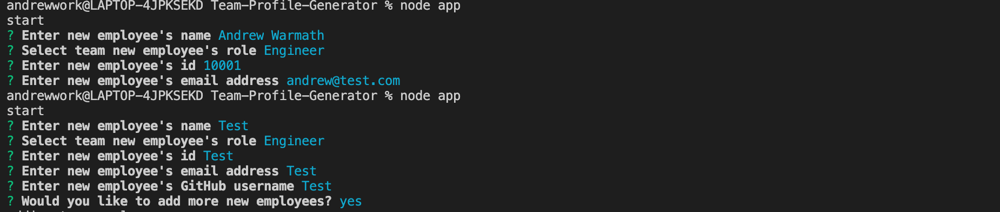
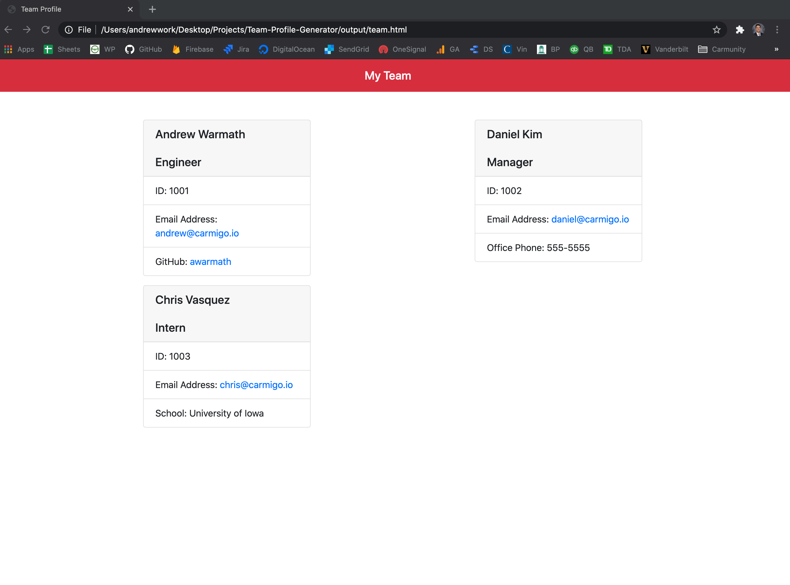

# Team-Profile-Generator

## Description 

The Team Profile Generator is an application ran from your command line to build a list of team members. By following the prompts in your terminal you will enter the employee's name, role, employee id, email address among other key information. Once the user inputs the employee information, an HTML file is built with easy to read employee cards that can be viewed on your local browser. 

## Table of Contents

* [Installation](#installation)
* [Usage](#usage)
* [Questions](#questions)

## Installation

Before the app will run on your computer you will first need to run an npm install for both Inquirer and JS dependencies. 

## Usage 

Once you navigate to the appropriate folder in your terminal, simply input "node app" for the prompts to begin. You will start by entering the employee's name, role, employee ID, email address and a few other pieces of information related to the employee's role. Once you finish adding all your employees the HTML file will be automatically generated. 

You can locate your generated HTML file in the output folder. Open the file in your local browser to see your clean employee list. 

See below for full walkthru video

## Questions?
  
 
  
For any questions, please contact me with the information below:
 
GitHub: [@awarmath](https://api.github.com/users/awarmath)
Email: andrewwarmath@gmail.com